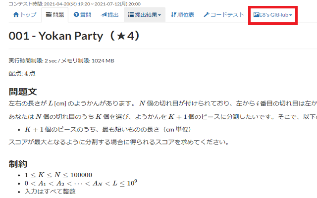

# Typical90_Extension

AtCoderの「競プロ典型 90 問」のWEBページを少し使いやすくするChrome拡張です。

* [E869120](https://github.com/E869120/kyopro_educational_90) さんの問題画像、解説画像、サンプルコードへのリンクを追加します。

* 問題を難易度順に並び替えることができるようになります。

# Install

Chrome Web Storeからインストールしてください：https://chrome.google.com/webstore/detail/typical90extension/olilmbfbgdnilofdfbladkgbbfecbidb

# For Devs

開発者用のドキュメントは[ここ](README_devs.md)を見てください。

